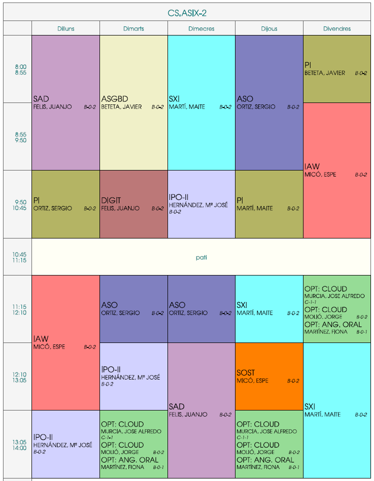

---
# Informació general del document
title: Presentació del curs 2025-2026
subtitle: 2n ASIX
authors: 
    - Departament d'informàtica
lang: ca
page-background: img/bg1.png

# Portada
titlepage: true
titlepage-rule-height: 0
# titlepage-rule-color: AA0000
# titlepage-text-color: AA0000
titlepage-background: img/portada.png
# logo: img/logotext.png

# Taula de continguts
toc: true
toc-own-page: true
toc-title: Continguts

# Capçaleres i peus
header-left: Presentació Curs
header-right: Curs 2025-2026
footer-left: IES Jaume II El Just
footer-right: \thepage/\pageref{LastPage}

# Imatges
float-placement-figure: H
caption-justification: centering

# Llistats de codi
listings-no-page-break: false
listings-disable-line-numbers: false

header-includes:
     - \usepackage{lastpage}
---

# Horari 2ASIX

{ width=95% }

# Professorat

* **IPO2:** 
    * ***Empresa i iniciativa Emprenedora***
    * ***Professora***: Mª José Hernández

* **SAD + Digitalització**
    * ***Seguretat i alta disponibilitat***
    * ***Professor***: Juanjo Felis

* **ASO + Projecte:**
    * ***Administració de sistemes operatius*** 
    * ***Professor***: Sergio Ortiz

* **ASGBD + Projecte**
    * ***Administració de sistemes gestors de bases de dades***
    * ***Professor:*** Javier Beteta

* **SXI + Projecte:**
    * ***Servicis de xarxa i Internet*** 
    * ***Professora***: Maite Martí

* **IAW + Sostenibilitat:**
    * ***Implantació d'aplicacions web***
    * ***Professora***: Esperança Micó 

* **Optatives**:
    * ***Cloud***: Jorge Molió / José A. Múcia
    * ***Anglès Oral***: Fiona Martínez

# Tutoria

* Esperança Micó
* ***e-mail***: me.micomendez@edu.gva.es
* ***Tutoria***: dimecres 9:50
* ***Atenció a Famílies***: (amb cita prèvia)

