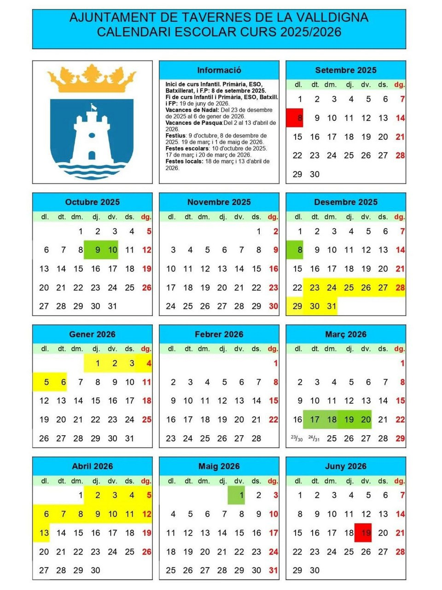

---
# Informació general del document
title: Presentació del Curs 2025-2026
subtitle: 2n ASIX
authors: 
    - Departament d'Informàtica
lang: ca
page-background: img/bg1.png

# Portada
titlepage: true
titlepage-rule-height: 0
# titlepage-rule-color: AA0000
# titlepage-text-color: AA0000
titlepage-background: img/portada.png
# logo: img/logotext.png

# Taula de continguts
toc: true
toc-own-page: true
toc-title: Continguts

# Capçaleres i peus
header-left: Presentació Curs
header-right: Curs 2025-2026
footer-left: IES Jaume II El Just
footer-right: \thepage/\pageref{LastPage}

# Imatges
float-placement-figure: H
caption-justification: centering

# Llistats de codi
listings-no-page-break: false
listings-disable-line-numbers: false

header-includes:
     - \usepackage{lastpage}
---

# Calendari escolar

* **1a Avaluació**: Setembre - Desembre 2025
    * ***Festius***:
        * ***dijous, 9 d'octubre***. Festa del País Valencià.
        * ***divendres, 10 d'octubre***. Festa escolar.
        * ***dilluns 8 de desembre***: Festa de la Immaculada.
        
* **2a Avaluació**: Desembre 2025 - Març 2026
    * ***Festius***:
        * ***dimarts 23 de desembre de 2025 al dimarts 6 de gener de 2026***: Festes de Nadal.
  
* **3a Avaluació**: Març - Juny 2026
    * ***Festius***:
        * ***dimarts 17 al divendres 20 de març de 2026***: Falles.
        * ***dijous 2 al dilluns 13 d'abril***: Setmana Santa i Pasqua
        * ***divendres 1 de maig***: Dia del treballador

